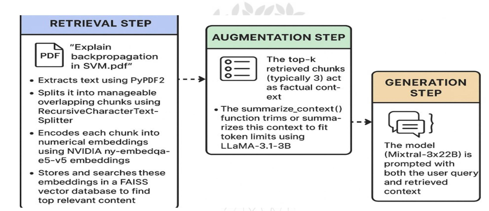

# CS791- Comprehensive viva

Multi-Agent System for Intelligent Query Processing

Presented by,

Mihir Modi- 202462001,

MTech (3rd Semester) in DS

Internal Guide, Guided by, Dr. Ravi Nahta Mukesh Siroya

# Overview

Introduction   
Problem Definition   
Motivation   
Workflow Diagram   
Implementation Details   
PDF Chatboard Extension   
Multi-Modal Extension   
Agentic RAG Extension   
APIs List   
Initial Results   
Conclusion   
Future Work   
Reference

Overview: A Python-based multi-agent system integrating weather, GitHub, Q&A, PDF querying, image analysis, and agentic RAG for intelligent, multi-domain query processing.

# Key Features:

• Typo correction (e.g., "Ahmmedabad" "Ahmedabad") using NVIDIA LLaMA-3 Asynchronous processing with asyncio for speed Modular agents: WeatherAgent, GitHubAgent, QAAgent Extensions: PDF Chatboard, Multi-Modal Image Analysis, Agentic RAG with evaluati

Objective: Deliver scalable, accurate, user-friendly query resolution.

Scope: Leverages NVIDIA, Gemini, WeatherAPI, and GitHub API in Google Colab

Given: Diverse user queries across domains (weather, repositories, general knowledge, documents, images)

Objective: Provide structured, efficient responses with minimal user effort

Challenges:

Varied Query Styles: Inconsistent inputs (e.g., "Patan temp" vs. "weather in Patan")   
API Restrictions: Rate limits and potential failures   
Scalability: Handle multiple simultaneous queries quickly   
Accuracy: Correct typos and resolve ambiguous inputs

Goal: Build an AI-driven, typo-correcting, scalable query processing system

Why It Matters: Fast, accurate information access is critical for decision-making in education, software development, and daily planning

Real-World Impact:

Software Development: Quick GitHub repo insights for collaboration Education: Reliable answers for students and researchers Daily Use: Real-time weather for planning (e.g., city storm response)

# Benefits:

Modularity: Easy to add new agents Efficiency: Async processing and caching User-Friendly: Typo correction and suggestions Extensibility: Supports new APIs and tasks

# WorkFlow Diagram

# Implementation Details

Environment: Google Colab, Python $3 . 1 0 +$ , asyncio for asynchronous processing.

Key Libraries:

Core: langchain, langgraph, faiss-cpu, ragas, PyPDF2, google-generativeai.   
Support: requests, beautifulsoup4, pillow, pydantic, nest_asyncio, backoff.

# Techniques:

Async I/O for parallel query handling.   
FAISS vector store for efficient retrieval.   
Pickle-based caching for API call reduction.   
Backoff retries for robust API interactions.

# Key Functions:

correct_spelling(): Typo correction via NVIDIA LLaMA-3.   
process_query(): Agent-specific logic.   
main(): Async console interface.

# PDF Chatboard Extension

What: Console-based tool for uploading and querying PDFs.

Why: Enables document-specific Q&A for research and education

# How:

Uploads PDFs via google.colab.files   
Extracts text with PyPDF2 and cleans using regex   
Answers queries with NVIDIA LLaMA-3.1-8B-Instruct via OpenAI SDK.

# Key Functions:

save_pdf_to_local(): Saves uploaded PDFs   
extract_text_from_pdf(): Processes text   
generate_answer(): Delivers concise responses (1-2 sentences)

Example: Query “What is NLP?” on a PDF yields concise answer

# PDF Chatboard Output

Your query: what is svm，give me ans from svm.pdf I believe you meant:'What is SVM? Give me an answer from SVM.pdf'

□ Answer (Source:PDF Chatboard (RAG on SVM.pdf)):

Here is a concise answer:

SVstandsforisaaiiaoaetetn ===

Your query: what is svm , give me ans from svm.pdf I believe you meant: 'What is SVM? Give me an answer from SVM.pdf'

# Answer (Source: PDF Chatboard (RAG on SVM.pdf)):

is a concise answer: SVM stands for Support Vector Machines, which is a binary classification technique that aims to maximize the margin between two classes by finding the optimal hyperplane that separates them. The SVM decision function can als be represented as a linear programming problem, allowing for the generalization of th optimization problem to multi-class classification.

What: Analyzes .jpg/.png images using Gemini 2.5 Flash or local fallback

Why: Provides structured visual analysis for diverse applications

# How:

Uploads images via google.colab.files Gemini API for detailed analysis (scene, objects, colors, environment) Local PIL-based fallback for API failures (metadata analysis)

# Key Functions:

VisionAnalyzer.setup_gemini(): Initializes Gemini model gemini_vision_analysis(): Structured image analysis advanced_local_vision(): Fallback for offline processing

# Multi-Modal Output

Your query: how may boats inimage_trial.png? $\mathfrak { Q }$ Analyzingimage_trial.png..

Answer (SOurce: GEMINI 2.5 VISION ANALYSIS):

There are \*\*2\*\* boats visible in the image.

# Agentic RAG

What: Retrieval-Augmented Generation with evaluation

Why: Enhances Q&A with context-aware, evaluated responses

How RAG Works

Retrieval Step:

When a user queries a PDF (e.g., “Explain backpropagation in SVM.pdf”), the system:

Extracts text using PyPDF2.   
Splits it into manageable overlapping chunks using RecursiveCharacterTextSplitter.   
Encodes each chunk into numerical embeddings using NVIDIA nv-embedqa-e5-v5 embeddings.   
Stores and searches these embeddings in a FAISS vector database to find top relevant content.

# • Augmentation Step:

• The top-k retrieved chunks (typically 3) act as factual context.   
• The summarize_context() function trims or summarizes this context to fit token limits using LLaMA-3.1-8B.

# Generation Step:

• The model (Mixtral-8x22B) is prompted with both the user query and retrieved context. • It produces an informed, concise answer consistent with the underlying document

<table><tr><td rowspan=1 colspan=1>API</td><td rowspan=1 colspan=1>Source</td><td rowspan=1 colspan=1>Data Provided</td></tr><tr><td rowspan=1 colspan=1>WeatherAPI</td><td rowspan=1 colspan=1> weatherapi.com</td><td rowspan=1 colspan=1> Temperature, humidity,wind (JSON)</td></tr><tr><td rowspan=1 colspan=1>GitHub API</td><td rowspan=1 colspan=1> github.com</td><td rowspan=1 colspan=1> Repository metadata (stars, language)</td></tr><tr><td rowspan=1 colspan=1>NVIDIA API</td><td rowspan=1 colspan=1> integrate.api.nvidia.com</td><td rowspan=1 colspan=1>Query processing and response generation</td></tr><tr><td rowspan=1 colspan=1>Google Gemini API</td><td rowspan=1 colspan=1> genai.googleapis.com</td><td rowspan=1 colspan=1> Multi-modal image Analysis</td></tr><tr><td rowspan=1 colspan=1></td><td rowspan=1 colspan=1></td><td rowspan=1 colspan=1></td></tr></table>

Challenges:

API Rate Limits: Frequent API calls lead to throttling Typo Handling: Misspelled queries (e.g., "Mehasana" vs. "Mehsana") Async Complexity: Managing concurrent tasks in Colab Data Scalability: Processing large PDFs or image datasets

# Solutions:

Caching: Pickle-based response caching to reduce API calls Typo Correction: NVIDIA LLaMA-3 for spelling fixes Asyncio: Parallel query processing with nest_asyncio Modular Design: FAISS and LangGraph for scalable retrieval

# Results

Efficiency: Python’s asyncio saving time and resources for all queries.

Speed: Delivers fast responses using asynchronous processing, ensuring quick results for any task.

Accuracy: Achieves high reliability, with the Weather Agent being more accurate for cities worldwide.

Smart Correction: Using Pre_train(LLaMA-3) model’s API calls to fixes typos (e.g., "temp" to "temperature") to improve results for any query.

Evaluation Results: {'faithfulness': 0.8333, 'answer_relevancy': 0.4270, 'context_precision': 0.6667, 'context_recall': 0.4444, 'answer_correctness': 0.7224}

# Key Achievements:

Integrated WeatherAPI, GitHub API, NVIDIA API, and Gemini API Scalable multi-agent system with typo correction and async processing Extended with PDF querying, image analysis, and evaluated RAG

# Impact:

Enhances real-time access for education, development, and planning Demonstrates robust, modular AI system design

Takeaway: Unified platform for intelligent, multi-domain query processing

# Additional Agents:

Stock market data retrieval (real-time stock prices) News summary agent for current events

# Actionable Agents:

Tasks like sending emails or updating databases Example: Weather-based appointment booking.

# References

 LangChain Academy. (n.d.). Intro to LangGraph. https://academy.langchain.com/courses/intro-to-langgraph

ByteByteGo. (n.d.). GenAI System Design Interview: Introduction and Overview. https://bytebytego.com/courses/genai-sy stem-design-interview/introduction-and-overview

Karpathy, A. (n.d.). YouTube Playlists. https://www.youtube.com/ $@$ AndrejKarpathy/playlists

YouTube Video. (n.d.). LangChain Tutorial. https://youtu.be/wMVzCctmtLI

 Fan, Y., Ma, X., Wu, R., Du, Y., Li, J., Gao, Z., & Li, Q. (2025). VideoAgent: A Memory-augmented Multimodal Agent for Video Understanding. https://arxiv.org/abs/2410.00000

Llama Team. (2024, July 23). The Llama 3 Herd of Models (Version 3). arXiv preprint arXiv:2407.21783. https://arxiv.org/abs/2407.21783

# Thank You!